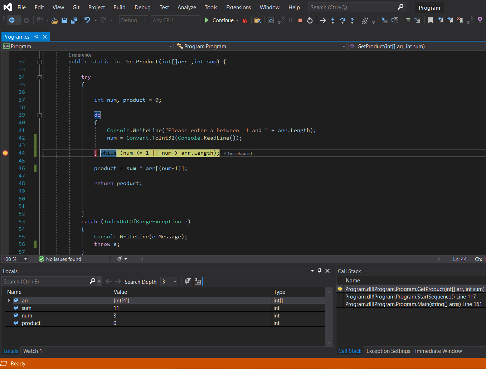
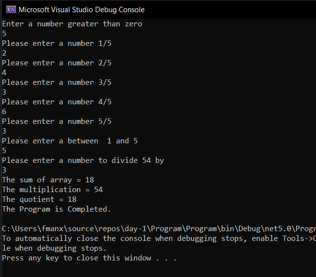
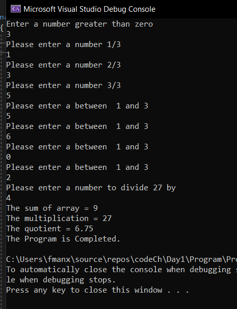
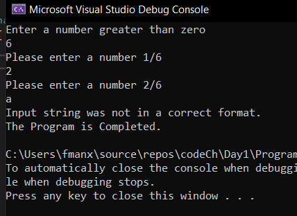


# Lab: 01a - Numbers Game

## MY Code
---
```
using System;

namespace Program
{
    class Program
    {

        public static decimal GetQuotient(int product) {


            try
            {

               decimal result = 0;

            Console.WriteLine("Please enter a number to divide " +product +" by");
           
            
            result= Decimal.Divide(product, Convert.ToInt32(Console.ReadLine()));

            return result;
            }
            catch (DivideByZeroException e)
            {
                Console.WriteLine(e.Message);
                return 0;
            }
           

        }

        public static int GetProduct(int[]arr ,int sum) {

            try
            {

                int num, product = 0;

                do
                {
                    Console.WriteLine("Please enter a between  1 and " + arr.Length);
                    num = Convert.ToInt32(Console.ReadLine());

                } while (num <= 1 || num > arr.Length);

                product = sum * arr[(num-1)];

                return product;


            }
            catch (IndexOutOfRangeException e)
            {
                Console.WriteLine(e.Message);
                throw e;
            }
          
        }

        public static int GetSum(int[] arr) {
            
            int sum = 0;
            try
            {
          

            foreach (int i in arr)
            {
                sum += i;
            }

            return sum;
            }
            catch (Exception)
            {

                throw new Exception($"Value of {sum} is too low");
            }
           
        }

        public static int[] Populate(int[] arr) {

           
                for (int i = 0; i < arr.Length; i++)
                {

                    Console.WriteLine("Please enter a number " + (i + 1) + "/" + arr.Length);
                    String s = Console.ReadLine();
                    arr[i] = Convert.ToInt32(s);

                }

               return arr;


         
      
            }

        public static void StartSequence() {


            try
            {

                Console.WriteLine("Enter a number greater than zero");

                int[] arr = new int[Convert.ToInt32(Console.ReadLine())];

                Populate(arr);

                int sum = GetSum(arr);


                int multArr = GetProduct(arr, sum);


                decimal quot = GetQuotient(multArr);


                Console.WriteLine("The sum of array = " + sum);
                Console.WriteLine("The multiplication = " + multArr);
                Console.WriteLine("The quotient = " + quot);


            } catch (IndexOutOfRangeException ){

                throw;
            }
             catch (FormatException f) {

                Console.WriteLine(f.Message);
                
            }
            catch (OverflowException o)
            {
                Console.WriteLine(o.Message);

            }
            catch (Exception e) {

                Console.WriteLine(e.Message);

            }
         
           

         
        }


        static void Main(string[] args)
        {

                try
            {


                StartSequence();


            }
            catch (Exception e)
            {
                Console.WriteLine(""+ e.Message);
            }
            finally
            {
                Console.WriteLine("The Program is Completed.");
            }

        }
    }
}
```
-----
**depuging with breakpoint**



##  setting up this program.

1. clone this repo in visual studio.
2. start depuging .
3. add the number like the program told you

**purpose of the program**
is to compute an do some operation on array.

**how program look like**


## when it works correctly

-----



## when the user enter number  larger than the array size 

-----



## when the user try to enter characters 

--------




